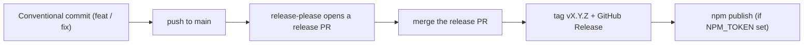

# Releases & Versioning

The project uses [Semantic Versioning](https://semver.org/) with
[Conventional Commits](https://www.conventionalcommits.org/), automated by
[release-please](https://github.com/googleapis/release-please).

## How a release happens

1. Merge a `feat:` or `fix:` commit into `main`.
2. release-please opens a **release PR** that bumps the version and updates
   `CHANGELOG.md`.
3. Merging that PR tags the release and publishes a GitHub Release with
   auto-generated notes.

## Commit types

| Prefix | Bump | Example |
| --- | --- | --- |
| `feat:` | minor (patch pre-1.0) | `feat(cli): add summary command` |
| `fix:` | patch | `fix(core): handle empty feed` |
| `docs:` | none | `docs: clarify config` |
| `chore:` | none | `chore: bump deps` |

## CI

- **ci** — install, build, and typecheck on every PR and push.
- **release** — runs release-please; publishes to npm when an `NPM_TOKEN`
  secret is present (skipped cleanly otherwise).
- **commitlint** — validates commit messages on PRs.

## Changelog

See the full history in
[CHANGELOG.md](https://github.com/Ayush7614/personal-context/blob/main/CHANGELOG.md)
and the
[GitHub Releases](https://github.com/Ayush7614/personal-context/releases).
